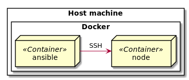

# Ansible Warrior

A tutorial that helps to get to know important [Ansible](https://www.ansible.com/) features around
SSH Key authentication, secret encryption and [Ansible Galaxy](https://galaxy.ansible.com/) role management required
for any mature Ansible project.

This project relies on [nl2go/docker-ansible](https://github.com/nl2go/docker-ansible) providing a [Docker](https://www.docker.com/)
image for Ansible with additional convenience features.

## Prerequisites

Before getting started, following packages must be installed.

- [Git](https://git-scm.com/downloads)
- [Docker](https://docs.docker.com/v17.09/engine/installation/) `>= 17.x`
- [Docker Compose](https://docs.docker.com/compose/install/) `>= 2.x`

## Preparations

1. Clone this project to the directory of your choice.

        $ git clone https://github.com/nl2go/ansible-warrior.git
        $ cd ansible-warrior

## Setup

The tutorial solely involves interactions within the host machine. The setup
consists of two Docker containers:
- `ansible` - the Ansible Controller
- `node` - a node to be controlled by Ansible

See [docker-compose.yml](docker-compose.yml) for further details.

## Scenarios

Using Ansible inside a container gets rid of very annoying issues that might appear when running it directly on the host
a.k.a the "works on my machine" issue set, which includes:

 - Missing dependencies
 - Deviating package versions
 - Local quirks of different host operating systems
 
Those issues become even bigger when your team grows.

### Key Based Authentication
SSH key authentication is widely preferred over password authentication because it provides more flexibility and safety
for the user. Private keys are stored on the disk protected by a passphrase specified by the user to prevent unauthorized
access to the key content.

This scenario shows how to use the private key protected by a passphrase when running the Ansible container utilizing 
the *ssh-agent* to prevent passphrase retyping.

1. The test private key is located at `.docker/root/.ssh/id_rsa`.

       $ ls .docker/root/.ssh
       drwxr-xr-x 3 user  user  4096 Aug 28 12:40 .
       drwxr-xr-x 3 user  user  4096 Aug 28 12:36 ..
       -rw-r--r-- 1 user  user   381 Aug 28 12:36 authorized_keys
       -rw-r--r-- 1 user  user  1766 Aug 28 12:36 id_rsa
  
1. Run Ansible container.

        $ docker-compose run ansible
    
1. Specify test private key passphrase `Abcd1234`.

        ...
        Starting SSH Agent.
        Enter passphrase for /root/.ssh/id_rsa: 

1. Ensure test private key was added to the SSH agent.

        ...
        Identity added: /root/.ssh/id_rsa (/root/.ssh/id_rsa)
        ...
 
1. Inspect `key_authentication` Ansible playbook.

        $ cat key_authentication.yml
        ---
        - hosts: node
          gather_facts: no
          tasks:
            - name: Test SSH connection using private/public key pair.
              ping:
 
    The playbook connects to the remote `node` host and executes the `ping` module, which performs basic
    connection and host sanity checks.
    
1. Run `key_authentication` Ansible playbook.

        $ ansible-playbook -i inventories/dev/hosts.ini key_authentication.yml
        
        PLAY [node] ****************************************************
        
        TASK [Test SSH connection using private/public key pair.] ******************
        ok: [node]
        
        PLAY RECAP *****************************************************************
        node           : ok=1    changed=0    unreachable=0    failed=0   

1. Exit Ansible container.
    
        $ exit

#### Recap
You have successfully run the playbook `key_authentication.yml` against `node` host using SSH key authentication.

### Ansible Galaxy Role

In advanced Ansible projects it's not uncommon to rely on already existing roles created and shared by the community members
as roles within [Ansible Galaxy](https://galaxy.ansible.com/).

This scenario shows how to handle the role dependency management.

1. Inspect `galaxy_role.yml` to extract the required role dependencies.

        $ cat galaxy_role.yml 
          ---
          - hosts: node
            become: true
            roles:
              - role: chusiang.helloworld

    The playbook `galaxy_role` relies on the Ansible Galaxy role `chusiang.helloworld`.
    To be able to execute the playbook the role must be installed first.

1. Create `requirements.yml` within the `roles` directory as required by [Ansible Tower](https://www.ansible.com/products/tower).

        $ mkdir roles && touch roles/requirements.yml
        
1. Add `chusiang.helloworld` role to the `roles/requirements.yml`.

        $ echo '- src: chusiang.helloworld' > roles/requirements.yml

1. Inspect the content of `roles/requirements.yml`.

        $ cat roles/requirements.yml
        - src: chusiang.helloworld
        
    The `requirements.yml` now contains the required role dependency that will be installed
    from the Ansible Galaxy.

1. Run Ansible container.

        $ docker-compose run ansible
        Skipping SSH Agent start. No private key was found at /tmp/.ssh/id_rsa.
        Skpping Anisble Vault password decryption. No .vault-password files present.
        Installing Ansible Galaxy roles from /ansible/roles/requirements.yml.
        - downloading role 'helloworld', owned by chusiang
        - downloading role from https://github.com/chusiang/helloworld.ansible.role/archive/master.tar.gz
        - extracting chusiang.helloworld to /root/.ansible/roles/chusiang.helloworld
        - chusiang.helloworld (master) was installed successfully
        
1. Run `galaxy_role.yml` playbook.

        $ ansible-playbook -i inventories/dev/hosts.ini galaxy_role.yml

1. Exit Ansible container.
    
        $ exit
        
1. Remove `roles/requirements.yml`.

        $ rm roles/requirements.yml

#### Recap
You have successfully installed an Ansible Galaxy Role and run the `galaxy_role.yml` playbook.

### Ansible Vault Master Password

Working with Ansible Vault passwords directly can be cumbersome since it's common to protect the secrets using at least one
dedicated password per inventory or environment. Besides that the secret for a specific inventory/environment must be 
specified on every playbook execution. This might reduce the productivity while working with Ansible.

To overcome this issues a personal master password for Ansible Vault inventory/environment password encryption can be
used.

This scenario shows how to encrypt and persist the Ansible Vault inventory/environment password protected by a personal
master password. 

1. Run Ansible container.

        $ docker-compose run ansible
        
1. Generate encrypted vault password file for the `dev` inventory using master password `master` and the inventory Vault
password `Abcd1234`.

        $ cd inventories/dev
        $ ansible-encrypt-vault-password
        Enter the master password for .vault-password files:
        Enter the vault password for dev inventory:
        Created /ansible/inventories/dev/.vault-password.
        
1. Inspect the content of the encrypted vault password file:

        $ cat .vault-password
        Salted__��iwC�Z���+'�|���;��       
        
1. Exit Ansible container.
    
        $ exit

1. Run Ansible container and specify the Vault master password `master`.

        $ docker-compose run ansible
        Skipping SSH Agent start. No private key was found at /tmp/.ssh/id_rsa.
        Decrypting Ansible Vault passwords.
        Enter decryption password for .vault-password files: 
        Decrypting /ansible/inventories/dev/.vault-password.
        Skipping Ansible Galaxy roles installation. No /ansible/roles/requirements.yml file present.

1. Run `vault_master_password` playbook.

        $ ansible-playbook -i inventories/dev/hosts.ini vault_master_password.yml
        
        PLAY [localhost] ***********************************************************
        
        TASK [Gathering Facts] *****************************************************
        ok: [localhost]
        
        TASK [debug] ***************************************************************
        ok: [localhost] => {
            "msg": "foobar123"
        }
        
        PLAY RECAP *****************************************************************
        localhost                  : ok=2    changed=0    unreachable=0    failed=0   

1. Exit Ansible container.
    
        $ exit
        
#### Recap

You have successfully run the `vault_master_password` playbook while decrypting the `secret_message` variable to `Hello World!`.

### Ansible Vault Secret

To protect sensitive data it must be encrypted before sharing it with remote sources. In general any kind of passwords,
secrets or keys must be encrypted.

This scenario shows how to encrypt arbitrary values for particular inventories/environments. It relies on the existing
encrypted Vault password file for the `dev` inventory located at `inventories/dev/.vault-password` from the previous
scenario.

1. Run Ansible container.

        $ docker-compose run ansible
        
1. Run Ansible container and specify the Vault master password `master`.

        $ docker-compose run ansible
        Skipping SSH Agent start. No private key was found at /tmp/.ssh/id_rsa.
        Decrypting Ansible Vault passwords.
        Enter decryption password for .vault-password files: 
        Decrypting /ansible/inventories/dev/.vault-password.
        Skipping Ansible Galaxy roles installation. No /ansible/roles/requirements.yml file present.
        
1. Encrypt secret value `foobar123` for the `dev` inventory.

        $ ansible-vault encrypt_string --encrypt-vault-id 'dev' 'foobar123'
        !vault |
                  $ANSIBLE_VAULT;1.2;AES256;dev
                  34313833626331373036336338663831333833356532306363336532306362376232653835613035
                  6131303730313238633938636564663866356164383735610a353133613363663239326337313231
                  64333737343634356531383864313031333134646264373035626363363865343037306436363462
                  3832363461623233620a383135343062643433613763656462623565346363303866376264643661
                  6236
        Encryption successful

1. Replace the plain `bar` value within `inventories/dev/host_vars/localhost/foo.yml` with the encrypted
value from the previous step and verify the result.

        $ cat inventories/dev/host_vars/localhost/foo.yml
        ---
        bar: !vault |
          $ANSIBLE_VAULT;1.2;AES256;dev
          34313833626331373036336338663831333833356532306363336532306362376232653835613035
          6131303730313238633938636564663866356164383735610a353133613363663239326337313231
          64333737343634356531383864313031333134646264373035626363363865343037306436363462
          3832363461623233620a383135343062643433613763656462623565346363303866376264643661
          6236
         
1. Run the `vault_secret` playbook.

        $ ansible-playbook -i inventories/dev/hosts.ini vault_secret.yml
        
        PLAY [localhost] ***********************************************************
        
        TASK [Gathering Facts] *****************************************************
        ok: [localhost]
        
        TASK [debug] ***************************************************************
        ok: [localhost] => {
            "msg": "foobar123"
        }
        
        PLAY RECAP *****************************************************************
        localhost                  : ok=2    changed=0    unreachable=0    failed=0   

#### Recap

You have successfully encrypted an existing variable `bar` and executed the `vault_secret` playbook that
utilizes the encrypted variable.

## Maintainers

- [build-failure](https://github.com/build-failure)

## License

See the [LICENSE.md](LICENSE.md) file for details
